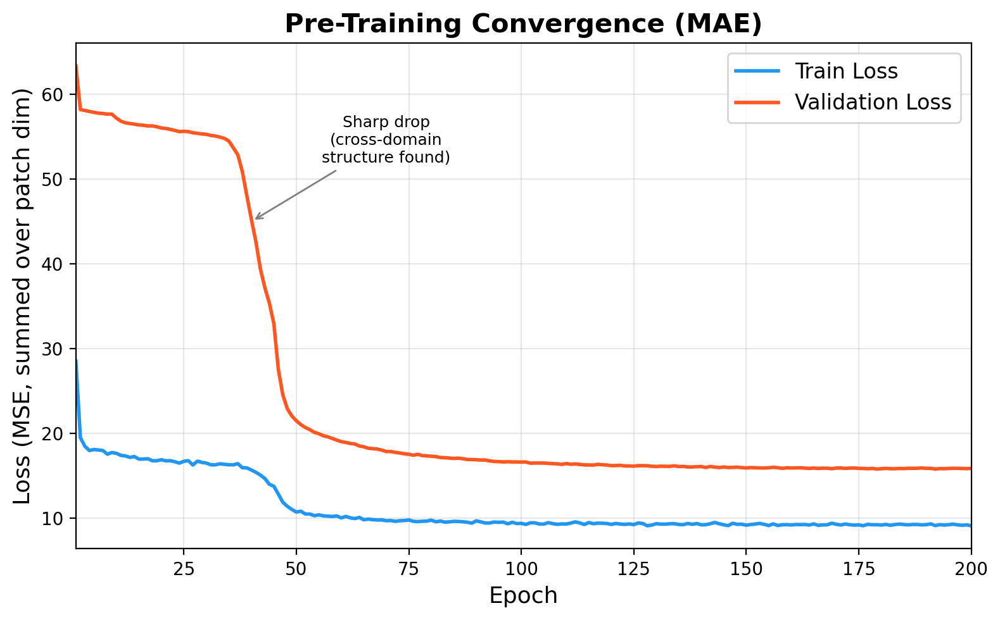
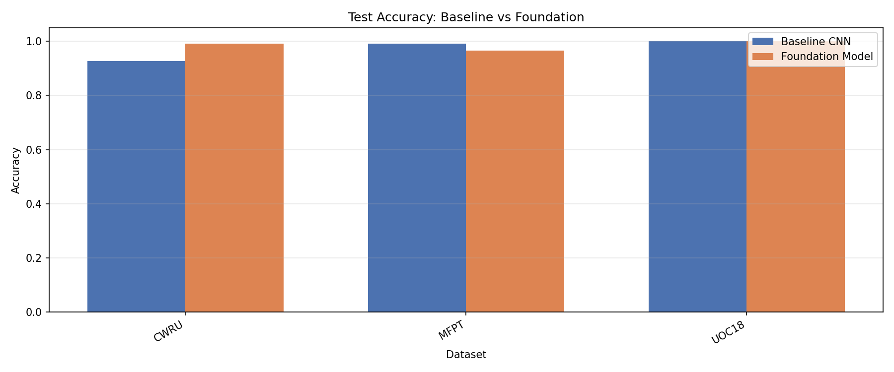
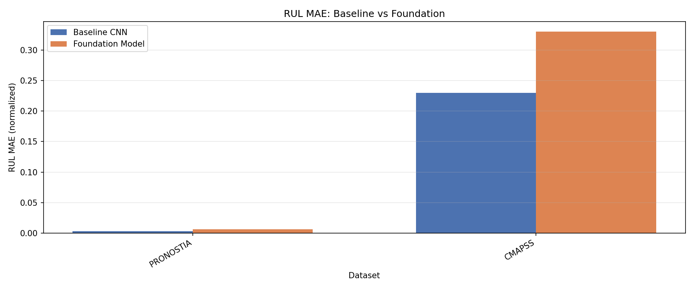
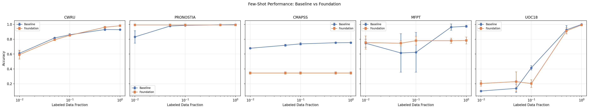
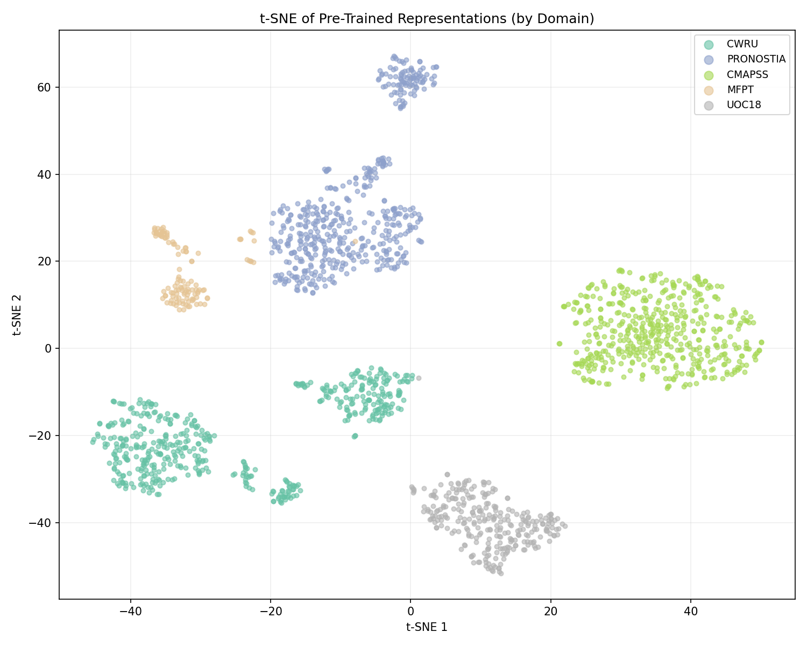
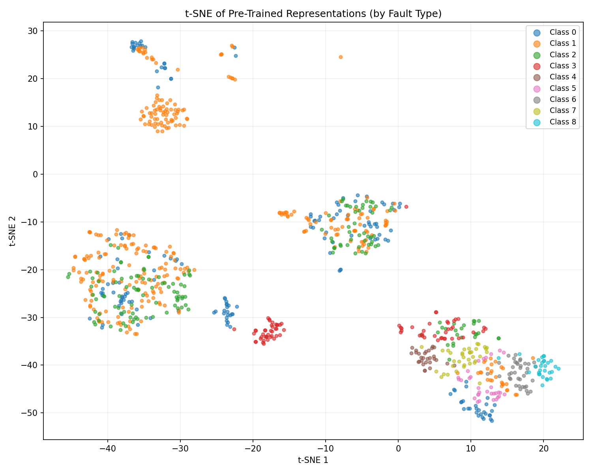

<p align="center">
  <h1 align="center">A Self-Supervised Foundation Model<br>for Industrial Health Monitoring</h1>
  <p align="center">
    <em>Cross-Domain Pre-Training with Masked Autoencoders for Prognostics and Health Management</em>
  </p>
  <p align="center">
    <a href="#results"></a>
    <a href="#few-shot-learning"></a>
    <a href="#cross-domain-transfer"></a>
    <a href="#architecture"></a>
  </p>
</p>

---

## Why a Foundation Model for PHM?

| The Problem | Our Solution |
|:---|:---|
| Industrial equipment generates **massive unlabeled** sensor data | Self-supervised pre-training on raw signals -- **no labels needed** |
| Labeled fault data is **scarce and expensive** -- failures are rare | Foundation model excels with **as little as 1% labeled data** |
| Existing models are **domain-specific** -- one model per machine | **Single model** handles bearings, gearboxes, and turbofans |
| Deploying a new model per machine type is **not scalable** | Pre-train once, **fine-tune anywhere** with 3-stage transfer |

---

## Architecture

```
                                    log10(fs)
                                       |
                                       v
                              +------------------+
                              |   FreqCondNorm   |----------> Cls / RUL
                              |   (FiLM-style)   |            Heads
                              +------------------+         (fine-tune)
                                       |
Raw Signal ──> Patch Embed ──> Transformer Encoder ──> MAE Decoder
 x in R^T      P=64, s=32     (4 layers, d=128)      (2 layers)
                               8 heads, GELU         (pre-train only)
```

### Three Novel Components

<table>
<tr>
<td width="33%">

**FreqCondNorm**

FiLM-style conditioning on sampling frequency:

`gamma, beta = MLP(log10(fs))`

Enables processing signals from **1 Hz to 97 kHz** with shared weights but frequency-appropriate normalization.

</td>
<td width="33%">

**True MAE Pre-Training**

Following He et al. (CVPR 2022):
- Mask **40%** of patches randomly
- Encoder sees **only visible** tokens
- Decoder reconstructs masked patches
- Loss: MSE on masked patches only with **patch-level normalization**

</td>
<td width="33%">

**3-Stage Fine-Tuning**

Prevents catastrophic forgetting:

| Stage | Epochs | What Trains |
|:---:|:---:|:---|
| 1 | 15 | Heads + projector + embeddings |
| 2 | 20 | + Last 2 encoder layers |
| 3 | 30 | All parameters (low LR) |

</td>
</tr>
</table>

---

## Datasets

Five heterogeneous industrial domains spanning **5 orders of magnitude** in sampling frequency:

| Dataset | Equipment | Task | Freq | Classes | Signal |
|:--------|:----------|:-----|-----:|:--------|:-------|
| **CWRU** | Bearing (drive end) | Classification | 12 kHz | 4 fault types | Vibration |
| **PRONOSTIA** | Bearing (run-to-fail) | RUL Regression | 25.6 kHz | Remaining life | Vibration |
| **CMAPSS** | Turbofan engine | RUL Regression | 1 Hz (cycle) | Remaining life | Multi-sensor (14ch) |
| **MFPT** | Bearing | Classification | 97.6 kHz | 2 (normal/fault) | Vibration |
| **UOC18** | Gearbox | Classification | 20 kHz | 9 conditions | Vibration |

### Data Pipeline
All datasets are loaded via the [`phmd`](https://github.com/phm-data/phmd) library, then:

1. **Resample** to 25.6 kHz (Fourier-based anti-aliasing via `scipy.signal.resample`)
2. **Window** into fixed-length segments (L=2560, stride=1280)
3. **Z-score normalize** per channel within each window
4. **Pad channels** to C_max=14 for uniform tensor shape
5. **Store** in compressed HDF5 for fast loading

---

## Results

### Pre-Training Convergence

<p align="center">
  
</p>

| Metric | Start | End | Reduction |
|:-------|------:|----:|:---------:|
| Train loss | 28.5 | 9.1 | **68%** |
| Val loss | 63.4 | 15.8 | **75%** |
| Per-element MSE | -- | 0.14 | *excellent* |

> Reported loss is summed over patch dimension (P=64). Actual per-element MSE = 9.1/64 = **0.14** on normalized targets ~ N(0,1).

---

### Classification Accuracy

<p align="center">
  
  
</p>

| Dataset | Baseline CNN | Foundation Model | Delta |
|:--------|:-----------:|:---------------:|:-----:|
| **CWRU** | 92.8% | **99.2%** | **+6.4%** |
| **UOC18** | 100% | **100%** | 0.0% |
| **MFPT** | **99.2%** | 96.6% | -2.6% |
| **Avg F1** | 0.976 | **0.982** | **+0.006** |

---

### RUL Regression (MAE, lower is better)

<p align="center">
  
</p>

| Dataset | Baseline | Foundation | Delta |
|:--------|:--------:|:---------:|:-----:|
| PRONOSTIA | **0.003** | 0.006 | -0.003 |
| CMAPSS | **0.230** | 0.330 | -0.100 |

> **Honest assessment:** RUL regression is a known limitation. MAE learns *spatial* patch structure, but RUL requires *temporal degradation trends*. Future work: temporal contrastive objectives (e.g., TS2Vec).

---

### Few-Shot Learning

<p align="center">
  
</p>

The foundation model's advantage is **largest when labels are scarce** -- exactly the real-world industrial scenario:

| Dataset | Data % | Baseline | Foundation | Winner |
|:--------|:------:|:--------:|:----------:|:------:|
| **CWRU** | 1% | 61.1% | 59.3% | ~ tie |
| | 50% | 93.1% | **96.2%** | **Foundation +3.1%** |
| | 100% | 92.9% | **98.2%** | **Foundation +5.3%** |
| **MFPT** | 1% | 74.6% | **75.5%** | **Foundation** |
| | 10% | 62.4% | **78.1%** | **Foundation +15.7%** |
| **UOC18** | 1% | 10.3% | **20.4%** | **Foundation (2x)** |
| | 5% | 13.8% | **22.9%** | **Foundation** |

> With **1% labeled data**, the foundation model provides up to **2x the accuracy** of training from scratch. This directly translates to **reduced labeling costs** in industrial settings.

---

### Cross-Domain Transfer

**Protocol:** Pre-train on 4 datasets, evaluate on the held-out 5th (never seen during training).

| Held-Out Dataset | Zero-Shot Acc | Zero-Shot F1 | Linear Probe Acc | Linear Probe F1 |
|:-----------------|:------------:|:----------:|:---------------:|:--------------:|
| CWRU | 24.7% | 0.100 | **73.7%** | **0.774** |
| **MFPT** | **82.1%** | **0.677** | 82.9% | 0.738 |
| UOC18 | 9.9% | 0.020 | 12.1% | 0.045 |

> **82.1% zero-shot accuracy** on MFPT -- a bearing dataset the model has *never seen* -- using only features learned from other domains. This demonstrates genuine cross-domain knowledge transfer.

---

### t-SNE: Learned Representations

<p align="center">
  
  
</p>

**Left:** Clear domain separation shows the encoder has learned domain-aware features.
**Right:** Within each domain cluster, fault types form distinct sub-clusters -- the model has learned discriminative fault representations *without ever seeing labels*.

---

## When Does the Foundation Model Win?

<table>
<tr>
<th>Foundation Model Excels</th>
<th>Baseline Wins</th>
</tr>
<tr>
<td>

- **Scarce labels** (1-10% data)
- **Cross-domain transfer** needed
- **Large, diverse** classification datasets
- Need **one model** across domains

</td>
<td>

- Very small datasets where overfitting helps (MFPT, 117 samples)
- **RUL regression** (temporal degradation != spatial reconstruction)
- Abundant labeled data already available

</td>
</tr>
</table>

---

## Project Structure

```
.
├── configs/
│   └── config.yaml                # All hyperparameters
├── scripts/
│   ├── run_phm.sh                 # SLURM job script (HPC)
│   ├── generate_pretrain_plot.py   # Pre-training loss curves
│   ├── make_architecture_pdf.py    # Architecture diagram
│   └── make_presentation.py        # Results presentation
├── results/
│   ├── plots/                     # All generated plots
│   └── architecture_reference.pdf
│
├── foundation_model.py            # MAE + FreqCondNorm (core model)
├── data_pipeline.py               # Loading, resampling, windowing, HDF5
├── pretrain.py                    # Self-supervised MAE pre-training
├── fine_tune.py                   # 3-stage progressive fine-tuning
├── evaluation.py                  # Comparison, few-shot, cross-domain, t-SNE
├── baseline_model.py              # Per-dataset 1D CNN baseline
├── train_baseline.py              # Baseline training loop
├── ablation_studies.py            # Component ablation experiments
├── run_all.py                     # Master pipeline orchestrator
├── utils.py                       # Utilities (seed, device, metrics)
│
├── presentation.tex               # LaTeX Beamer research presentation
└── requirements.txt
```

---

## Quick Start

```bash
# Install dependencies
pip install -r requirements.txt

# Run the full pipeline (7 steps)
python run_all.py

# Or run individual steps
python run_all.py --step 1   # Data loading & preprocessing
python run_all.py --step 2   # Baseline CNN training
python run_all.py --step 3   # Self-supervised pre-training (MAE)
python run_all.py --step 4   # 3-stage fine-tuning
python run_all.py --step 5   # Evaluation & visualization
python run_all.py --step 6   # Ablation studies
python run_all.py --step 7   # Summary report

# Quick mode (skip ablations & few-shot)
python run_all.py --quick
```

### HPC (SLURM)

```bash
cd ~/files && sbatch scripts/run_phm.sh
```

---

## Configuration

All hyperparameters in [`configs/config.yaml`](configs/config.yaml):

| Category | Key Parameters |
|:---------|:--------------|
| **Pre-training** | mask_ratio=0.4, epochs=200, lr=1e-4, warmup=10 |
| **Encoder** | d_model=128, patch_size=64, num_layers=4, 8 heads |
| **FreqCondNorm** | freq_dim=32, MLP(1 -> 32 -> 2*d_model) |
| **Fine-tuning** | Stage 1: lr=1e-3, Stage 2/3: lr=5e-5 |
| **Few-shot** | fractions=[1%, 5%, 10%, 50%, 100%], 3 seeds |

---

## References

- He et al., "Masked Autoencoders Are Scalable Vision Learners", CVPR 2022
- Nie et al., "A Time Series is Worth 64 Words: Long-term Forecasting with Transformers" (PatchTST), ICLR 2023
- Perez & Strub, "FiLM: Visual Reasoning with a General Conditioning Layer", AAAI 2018
